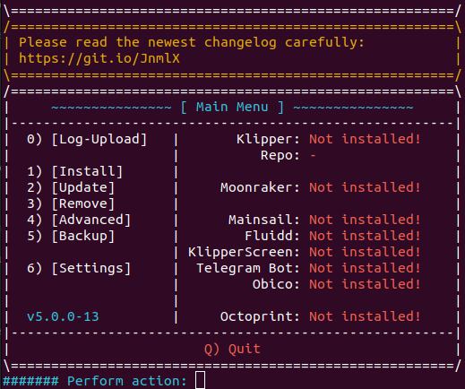
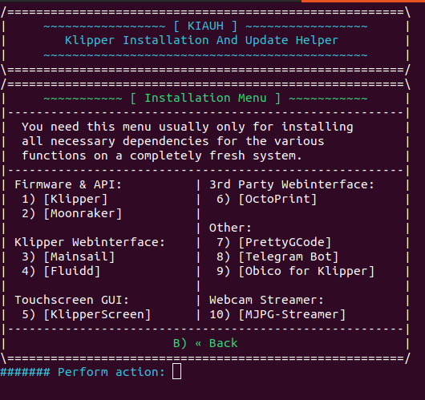
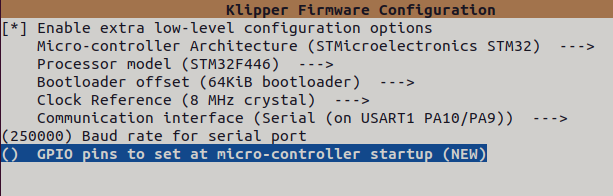
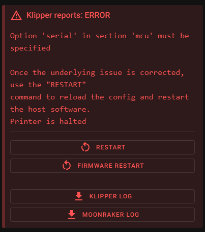
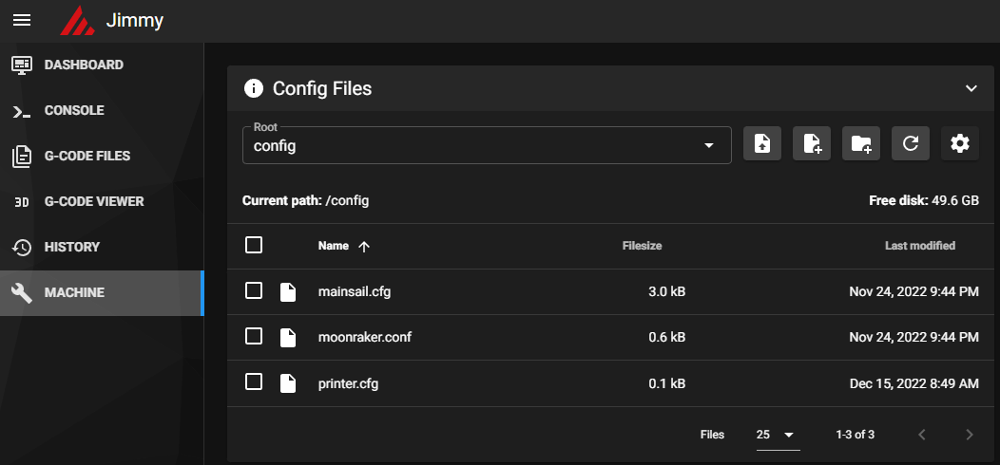

# Klipper-for-TronXY-X5SA-STM446-mainboard
A simple guide for installing Klipper on your TronXY X5SA with an STM32F446 chip

# Required hardware:
- Pi/computer running Pi OS Lite or any other debian branch
- Usb cable to connect to the printer
- 32GB or less sd card, I used the 8GB card that came with the printer

# Installing Klipper onto the Pi/ Linux computer using KIAUH
Check out the KIAUH repo for more detailed instructions: https://github.com/th33xitus/kiauh

SSH into your Pi or other computer and run
```
sudo apt install git 

cd ~

git clone https://github.com/th33xitus/kiauh.git

./kiauh/kiauh.sh
```
After you run all of those, your terminal should look similar to this:



Next, type in "1" to get to the install page.



Install Klipper, Moonraker, and Mainsail or Fluidd
# OPTIONAL: compile the firmware yourself

SSH into your Pi/computer and run 
```
cd ~/klipper/

make menuconfig
```

Change all the settings to be identical to the picture below.



To compile the Klipper firmware, press "Q" to exit the menu and when prompted, press "Y" to save. After it saves and exits the gui, run the command: 
```
make
```
The next step is getting the compiled "klipper.bin" file.

Using [Filezilla](https://filezilla-project.org/download.php?show_all=1), connect to your Pi/computer with the host being "sftp://"yourip" 

Once connected, go inside the "klipper" folder to another folder named "out".

Select where you want to download , right click the file named "klipper.bin" and press download.

Once downloaded, rename the file to "fmw_x5sa.bin" and move onto the next step


# Installing Klipper firmware onto the printer


**(Skip this step if you compiled the firmware yourself)** Go to this repo's directory: firmware and download the [fmw_x5sa_330](firmware/fmw_x5sa_330.bin) file.

Insert the SD card that you want to use to flash the printer into your pc.
Make sure that it is completely empty.

Create a folder and name it "update". Put the fmw_x5sa.bin file into that folder.

Eject the SD card, and turn off your printer. 

Insert the SD card and usb cable into the printer, and turn it on. The screen should get stuck on something like the image below if the flash is successful:


# Klipper setup on Pi/computer

Type in your Pi/computer's ip into your web browser, it should load with an error like this:



Copy everything from [THIS](config/stock_x5sa_config.txt) text file and paste it into machine->printer.cfg


- **NOTE:** You do have to manually change the rotation distance of the extruder, instructions can be found [HERE](https://www.klipper3d.org/Rotation_Distance.html#calibrating-rotation_distance-on-extruders) and the z_offset, which can be found [HERE](https://www.klipper3d.org/Rotation_Distance.html#calibrating-rotation_distance-on-extruders)

Congratulations! You have sucessfully installed klipper onto your X5SA with a STM32F446 chip! Happy printing and make sure to create an issue on this repo if you have any questions or suggestions.